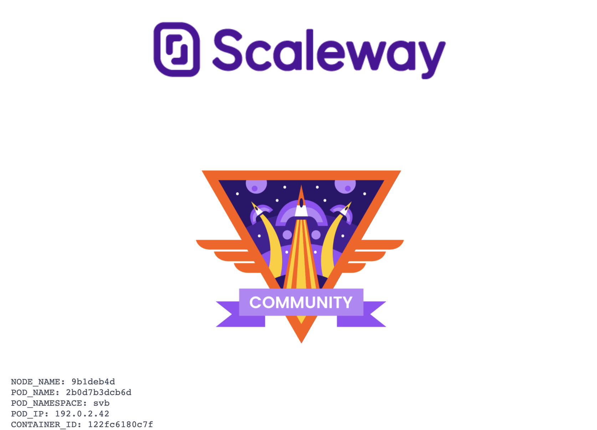

# Svb

Simple demo container for Scaleway



## Build docker container

docker build -t svb .
  
## Deploy Container

docker run -d --name svb -p 8080:8080 svb

## Deploy on Kubernetes 

```apiVersion: apps/v1
kind: Deployment
metadata:
  name: svb
spec:
  replicas: 2
  selector:
    matchLabels:
      app: svb
  template:
    metadata:
      labels:
        app: svb
    spec:
      containers:
      - name: svb
        image: justinbriard/svb:latest
        ports:
        - containerPort: 8080
        env:
          - name: MY_NODE_NAME
            valueFrom:
              fieldRef:
                fieldPath: spec.nodeName
          - name: MY_POD_NAME
            valueFrom:
              fieldRef:
                fieldPath: metadata.name
          - name: MY_POD_NAMESPACE
            valueFrom:
              fieldRef:
                fieldPath: metadata.namespace
          - name: MY_POD_IP
            valueFrom:
              fieldRef:
                fieldPath: status.podIP
          - name: MY_POD_SERVICE_ACCOUNT
            valueFrom:
              fieldRef:
                fieldPath: spec.serviceAccountName
---
apiVersion: v1
kind: Service
metadata:
  name: svb-svc
spec:
  ports:
  - port: 80
    targetPort: 8080
    protocol: TCP
    name: http
  selector:
    app: svb
```  
  
  

## TODO

- More 
